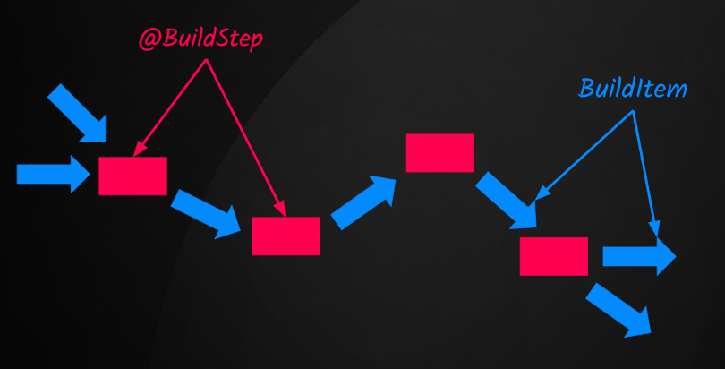

# Developing a Quarkus Extension

## TL;DR

This post demonstrates how to create a Quarkus extension that provides two features that:

- Notify an API regarding the application's `starting` status;
- Offer a implementation class created with [Gizmo](https://github.com/quarkusio/gizmo);
- Count the number of methods using `@GET`, `@POST`, `@PUT`, `@DELETE` annotations using [Jandex](https://github.com/smallrye/jandex);  

## Why Quarkus extension?

Quarkus is both a framework and a build time **augmentation** toolkit. Its principal concept is "do as much as possible during build time instead of runtime", this concept is what helps Quarkus achieve a very low startup time and a smaller memory footprint.

<!-- more -->
Quarkus enables the creation of a Native Image through Graal VM, making it an excellent choice for Serverless systems that require minimal startup time and memory usage.

Additionally, Quarkus is a framework that has been captivating developers with its development experience. In the growth of internal developer platforms that aim for a developer-friendly experience, the experience that Quarkus provides is something to be considered.

Keeping in mind these initial concepts, let's try to answer some questions:

- Some libraries perform actions at runtime (class path scanning, proxies, etc.) instead of build time. How can we modify them to the Quarkus closed world?

- Quarkus leverages the Graal SDK to generate a native application. However, it's essential to note that [Graal VM does need some tweaks](https://pt.quarkus.io/guides/writing-native-applications-tips), and the executable code needs to be known before running. How can I adjust the code to be used as correct input for GraalVM?

- Managing an Internal Developer Platform with over 100 Quarkus applications in production, I need to implement a specific cross-cutting approach across all applications. What is the recommended method to achieve this?

Commonly, the answer for all questions (when you are using Quarkus) is: **Create a Quarkus extension**.

<!-- more -->
## Quarkus CLI

The Quarkus CLI is an incredibly useful tool for working with Quarkus.

There are several ways to install the Quarkus CLI. 

??? info "Installing Quarkus CLI"

    [Refer to the official documentation for installation instructions](https://quarkus.io/guides/cli-tooling#installing-the-cli).

With Quarkus CLI, we can `create`, `build`, `deploy`, and perform essential tasks in a developer's day-to-day workflow. 

## What Will Our Extension Do?

- Notify an API regarding the application's `starting` status;
- Offer a simple implementation class with [Gizmo](https://github.com/quarkusio/gizmo);
- Count the number of methods using `@GET`, `@POST`, `@PUT`, `@DELETE` annotations using [Jandex](https://github.com/smallrye/jandex); 

!!! info "Note"
  
    All features are simple compared to real-world applications, but they serve as a great starting point to grasp and initiate your journey into the world of Quarkus extensions!

## Creating the Extension

Once the Quarkus CLI is installed, we will use it to create our useful extension.

```bash
quarkus create extension dev.matheuscruz:quarkus-useful:0.0.1-SNAPSHOT
```

The desired output should be similar to:

```bash
Detected layout type is 'standalone' 
Generated runtime artifactId is 'quarkus-useful'


applying codestarts...
📚 java
🔨 maven
📦 quarkus-extension
🚀 devmode-test
🚀 extension-base
🚀 integration-tests
🚀 unit-test

-----------
 👍  extension has been successfully generated in:
--> /home/cruz/github.com/mcruzdev/quarkus-useful
-----------
Navigate into this directory and get started: quarkus build
```

## Quarkus Extension structure

A Quarkus extension is divided in two modules, `deployment` and `runtime`.

- The `deployment` module contains various components, such as build steps and build items, that play important roles in the application **augmentation** process.

- The `runtime` module contains runtime code that are used by `deployment` module at build time. 

**It might seem odd: Why is runtime code executed and utilized by build-time code?**

> The reason is that runtime code is designed to be recorded for execution later. When you write this code, it's intended to be executed or used at a later stage.

!!! warning "Note"

    A `deployment` module must depend on the `runtime` module.

## [Feature #1] Implementing the Notifier

**What do we need here, and what is the expected behavior?**

We want that, when the application start we want to send a HTTP request to a specific endpoint, notifying that the application is starting.

!!! warning "Use Quarkus Lifecycle instead"

    This is merely a sample, demonstrating the capabilities of a Quarkus extension. Avoid using it in production scenarios. For a limited number of applications, consider utilizing the [Quarkus Lifecycle](https://quarkus.io/guides/lifecycle) feature instead.


### Creating our configuration

To call a REST service, you'll require the resource's URI. How can you retrieve this information or determine what the URI is?

We can do it into the code:

```java
private static final String REST_ENDPOINT = "https://api.quarkus.com/apps"
```

But, it is not a good practice. Quarkus aims to facilitate the creation of Cloud Native applications, and a good Cloud Native application uses (when necessary) [12 Factors - Configuration](https://12factor.net/config) approach.

We need to make this configurable. I don't want to change the code and go through the entire release process (pull requests, approvals, pipelines, deployment, etc.) just to upload my extension with a new endpoint. To achieve this, Quarkus allows us to accomplish it using the [Configuration](https://quarkus.io/guides/config-reference) feature. You simply need to create a POJO class and annotate it with `@io.quarkus.runtime.annotations.ConfigRoot`.

```java linenums="1" hl_lines="9"
package dev.matheuscruz.quarkus.useful.runtime;

import java.util.Optional;

import io.quarkus.runtime.annotations.ConfigItem;
import io.quarkus.runtime.annotations.ConfigPhase;
import io.quarkus.runtime.annotations.ConfigRoot;

@ConfigRoot(name = "useful", phase = ConfigPhase.BUILD_AND_RUN_TIME_FIXED)
public class UsefulConfiguration {

    /**
     * The listener URL to be notified about the 'starting' event of the
     * application.
     */
    @ConfigItem(name = "listenerUrl")
    public Optional<String> listenerUrl;
}
```

!!! tip "Defining a proprety as Optional"

    To define a configuration property as optional, you need to define the property as `Optional<T>`.

- The element `name` means the configuration property name. At the final the properties inside the `UsefulConfiguration` will be the prefix `quarkus.useful`.

- The element `phase` indicates when this configuration will be visible.


??? info "ConfigPhase enum"

    - `BUILD_TIME` - Values are read and available for usage at build time.
    - `BUILD_AND_RUNTIME_FIXED` - Values are read and available for usage at build time, and available on a read-only basis at run time.
    - `RUN_TIME` - Values are read and available for usage at run time and are re-read on each program execution.

Perfect, now that we have the configuration available, let's use it.

### Calling the HTTP Service

As mentioned previously, all code that executes at runtime should be in the `runtime` module.

Let's create the call to notify the `starting` event.

```java linenums="1" hl_lines="17 22 31"
package dev.matheuscruz.quarkus.useful.runtime;

import java.io.IOException;
import java.net.URI;
import java.net.http.HttpClient;
import java.net.http.HttpRequest;
import java.net.http.HttpResponse;
import java.net.http.HttpRequest.BodyPublishers;
import java.net.http.HttpResponse.BodyHandlers;

import org.eclipse.microprofile.config.ConfigProvider;
import org.slf4j.Logger;
import org.slf4j.LoggerFactory;

import io.quarkus.runtime.annotations.Recorder;

@Recorder //(3)
public class NotifyStartingEventRecorder {

    private static final Logger LOGGER = LoggerFactory.getLogger(NotifyStartingEventRecorder.class);

    public void notify(UsefulConfiguration config) { // (1)
        if (config.listenerUrl.isEmpty()) {
            LOGGER.warn(
                    "You are using the 'quarkus-useful' extension but the configuration property quarkus.useful.listenerUrl not defined");
            return;
        }

        try {

            String applicationName = ConfigProvider.getConfig() // (2)
                    .getConfigValue("quarkus.application.name")
                    .getValue();

            String body = String.format("{ \"applicationName\": \"%s\" }", applicationName);
            HttpRequest httpRequest = HttpRequest.newBuilder(URI.create(config.listenerUrl.get()))
                    .POST(BodyPublishers.ofString(body))
                    .build();

            HttpClient httpClient = HttpClient.newHttpClient();

            HttpResponse<String> httpResponse = httpClient.send(httpRequest, BodyHandlers.ofString());

            LOGGER.info("The quarkus-useful-extension gets the HTTP status code: {}",
                    httpResponse.statusCode());
        } catch (IOException | InterruptedException e) {
            LOGGER.error("It was not possible to notify the listenerUrl {}.", config.listenerUrl.get());
        }   
    }
}
```

1. Quarkus automagically injects the configuration POJO into the Recorder class.
2. Quarkus uses [Microprofile Config](https://microprofile.io/specifications/microprofile-config/) to access all provided configurations.
3. The annotation `@Recorder` indicates that the given type is a recorder that is used to record actions to be executed at runtime.

Perfectly, we have created our code that represents the code to be recorded. We will create now, the build step that will record this piece of code.


### Recording the `notify(UsefulConfiguration config)` method

Now, we will create the class responsible for recording our runtime code.

As mentioned previously all code related to the build process should be in `deployment` module. If you see into `deployment` module, there is a class called `QuarkusUsefulProcessor` (generated by Quarkus CLI):

```java hl_lines="10-13" linenums="1"
package dev.matheuscruz.quarkus.useful.deployment;

import io.quarkus.deployment.annotations.BuildStep;
import io.quarkus.deployment.builditem.FeatureBuildItem;

class QuarkusUsefulProcessor {

    private static final String FEATURE = "quarkus-useful";

    @BuildStep
    FeatureBuildItem feature() {
        return new FeatureBuildItem(FEATURE);
    }
}
```

The Quarkus CLI generated a method with the `@BuildStep` annotation, indicating that this method is a step in the build process. Build step methods can produce or consume build items. In this case, it produces one build item called `FeatureBuildItem`.

The `FeatureBuildItem` is used to include the feature (`quarkus-useful`) to be printed at startup, for example:

```sh 
Installed features: [cdi, quarkus-useful, resteasy, smallrye-context-propagation, vertx]
```
### Build Steps and Build Items




- Build steps are methods annotated with `@BuildStep` annotation that performs a step in the build process;

- Build items are:
> ... the communication mechanism between build steps - Holly Cummins 

- Quarkus automatically determines correctly execution order and injects parameters (`BuildItem`, `BuildProducer`, configuration classes, etc.);

- If you intend to utilize a build item through injection, remember that your build step will execute after the injected build item is produced;

- There are initial, intermediate, and terminal state build steps. Custom extensions are commonly found in the intermediate state.

### Creating the build step
Let's create the method in the `QuarkusUsefulProcessor` class that will handle recording our notifier.


```java linenums="1"
@BuildStep
@Record(value = ExecutionTime.RUNTIME_INIT)
void recordNotifyStartingEventRecorder(UsefulConfiguration config,
        NotifyStartingEventRecorder recorder) {
    // the following call will be recorded
    recorder.notify(config);
}
```

**What does the `@Record` annotation mean, and what is the value `ExecutionTime.RUNTIME_INIT`?**

The `ExecutionTime` enum has two options: `RUNTIME_INIT` and `STATIC_INIT`.

Let's dive into some simple code examples to understand how these choices impact bytecode.

```java
public class GeneratedBytecode {

  static {
    // @Record(value = ExecutionTime.STATIC_INIT)
    // All code recorded with STATIC_INIT will be here.
  }

  public static void main(String args[]) {
    // @Record(value = ExecutionTime.RUNTIME_INIT)
    // All code recorded with RUNTIME_INIT will be here.
  }
}
```

??? tip "See more: How to see the generated bytecode"

    If you want to see the bytecode generated, into extension root dir runs:

    - `mvn clean install`
    - cd `integration-tests`
    - `mvn clean package -DskipTests -Dquarkus.package.vineflower.enabled=true   `
    - `cat target/decompiled/generated-bytecode/io/quarkus/runner/ApplicationImpl.java`

    You will see that in the method `doStart(String[] var1)` there is a piece of code like it: `(new QuarkusUsefulProcessor$recordNotifyStartingEventRecorder1857232657()).deploy(var2);`

    The option `quarkus.package.vineflower.enabled=true` tell to Quarkus decompile generated and transformed bytecode into the 'decompiled' directory. 

Perfect, if you want to test the notifier, execute:

```sh
mvn clean install

cd integration-tests

quarkus dev
```

The output should looks like:

```sh
2024-01-06 19:17:34,449 WARN  [dev.mat.qua.use.run.NotifyStartingEventRecorder] (Quarkus Main Thread) You are using the 'quarkus-useful' extension but the configuration property quarkus.useful.listenerUrl not defined
```

It happened because we forgot to set the `quarkus.useful.listenerUrl` property into `application.properties` file. Add the configuration property to `application.properties` and observe the result.


??? tip "Mocking HTTP request"

        Use https://app.beeceptor.com/ this service to mock the HTTP request.

Now, that we have configured the `quarkus.useful.listenerUrl`, the output should looks like it: 

```sh
2024-01-12 14:23:26,817 INFO  [dev.mat.qua.use.run.NotifyStartingEventRecorder] (Quarkus Main Thread) The quarkus-useful-extension gets the HTTP status code: 200

2024-01-12 14:23:27,009 INFO  [io.quarkus] (Quarkus Main Thread) quarkus-useful-integration-tests 0.0.1-SNAPSHOT on JVM (powered by Quarkus 3.6.4) started in 3.753s. Listening on: http://localhost:8080
2024-01-12 14:23:27,012 INFO  [io.quarkus] (Quarkus Main Thread) Profile dev activated. Live Coding activated.
2024-01-12 14:23:27,012 INFO  [io.quarkus] (Quarkus Main Thread) Installed features: [cdi, quarkus-useful, resteasy, smallrye-context-propagation, vertx]
```
## [Feature #2] Implementing our GreetingService interface

In some scenarios, offering a default implementation to our extension consumers becomes necessary, as seen in great libraries. 

Essentially, in our case the user will inject a `GreetingService` interface, and the extension will provide a default implementation behind the scenes (using Gizmo :smile:).

The interface:

```java linenums="1"
public interface GreetingService {
  String message();
}
```

The user's code:

```java
@Path("/greetings")
public class GreetingResource {

  GreetingService service;

  // Injected by ArC dependency injection  
  public GreetingResource(GreetingService service) {
    this.service = service;
  }

  @GET
  @Produces(MediaType.TEXT_PLAIN)
  public String greeting() {
    return service.message();
  }
}
```

There are several ways to achieve this with Quarkus. One approach is implementing the interface and providing it by using CDI directly. However, let's get hands-on with Gizmo to get our initial experience with this tooling. 

### Gizmo

[Gizmo](https://github.com/quarkusio/gizmo) is a library used by Quarkus to generate bytecode. If you are interested, there is an amazing video by the Quarkus Core team that explains the library in a better way. You can watch it [here](https://www.youtube.com/watch?v=iZ501bG2ZAE). We will provide a simple implementation with Gizmo, but is it possible do more interesting things with this library, like [removing a bytecode to solve a specific problem](https://pt.quarkus.io/blog/solving-problems-with-extensions/).


### Creating the GreetingService

Into the `runtime` module, let's create our interface:

```java
package dev.matheuscruz.quarkus.useful.runtime;

public interface GreetingService {
    String message();
}
```

### Creating the implementation

Into the `deployment` module, let's create a new build step to generate our implementation.

```java linenums="1"
@BuildStep
void generateGreetingService(BuildProducer<GeneratedBeanBuildItem> generatedClasses) {
}
```

!!! info "@Record is not necessary"

    The `@Record` annotation isn't always mandatory. Sometimes, annotating the method solely with `@BuildStep` suffices to include it in the augmentation process. However, the `@Record` annotation becomes necessary when you intend to record a portion of runtime code.

There are two ways to generate a Build Item, the first one is returning the Build Item in method, and the second one is using the class `BuildProducer<T extends BuildItem>`.

Let's continue with the implementation:

```java linenums="1" hl_lines="2 3 6"  
@BuildStep
void generateGreetingService(BuildProducer<GeneratedBeanBuildItem> generatedClasses) {
      GeneratedBeanGizmoAdaptor gizmoAdapter = new GeneratedBeanGizmoAdaptor(generatedClasses);
    try (ClassCreator classCreator = ClassCreator.builder()
            .className("dev.matheuscruz.quarkus.useful.deployment.UsefulGreetingService")
            .interfaces(GreetingService.class)
            .classOutput(gizmoAdapter)
            .build()) {
                    
        classCreator.addAnnotation(ApplicationScoped.class);

        try (MethodCreator returnHello = classCreator.getMethodCreator("message",
                String.class)) {
            returnHello.setModifiers(Opcodes.ACC_PUBLIC);
            returnHello.returnValue(returnHello.load("Hello from Quarkus Useful extension"));
        }
    }
}
```

What this build step does ind depth? Let's see:

1. The `GeneratedBeanBuildItem` is a build item having the bytecode that will be added as CDI bean (after in the augmentation process).
  
2. The line **"3"**  is an adapter that uses the `BuildProducer<GeneratedBeanBuildItem>` injected into `generateGreetingService` method.

3. The line **"6"** we are indicating that the new class will implements the `GreetingService` interface.

4. In the line "**10"** we are adding the annotation `jakarta.ws.rs.ApplicationPath` to the new class.

5. The `ClassCreator` is the class responsible for generating the bytecode, the instance of `GeneratedBeanGizmoAdaptor` is used as `ClassCreator.classOutput` property.

6. When the method `ClassCreator#close()` is called the `ClassCreator` writes the bytecode inside de `GeneratedBeanGizmoAdaptor` instance. Note that we are using `try-with-resources`.

7. Behind the scenes the `GeneratedBeanGizmoAdaptor` uses the `BuildProducer<GeneratedBeanBuildItem>` instance to produces the a `GeneratedBeanBuildItem` instance.

??? info "See more: ClassCreator#close() implementation"

    ```java
    public void close() {
        final ClassOutput classOutput = this.classOutput;
        if (classOutput != null) {
            writeTo(classOutput);
        }
    }
    ```


??? info "See more: GeneratedBeanGizmoAdaptor#write() implementation"

    ```java
        @Override
    public void write(String className, byte[] bytes) {
        String source = null;
        if (sources != null) {
            StringWriter sw = sources.get(className);
            if (sw != null) {
                source = sw.toString();
            }
        }
        classOutput.produce(new GeneratedBeanBuildItem(className, bytes, source));
    }
    ```

### Using our hidden GreetingService implementation

Now, that we have the default implementation, let's use our `integration-tests` module to test it.

We need now to create a new resource called `GreetingResource`, to test our implementation:

```java linenums="1"
package dev.matheuscruz.quarkus.useful.it;

import dev.matheuscruz.quarkus.useful.runtime.GreetingService;
import jakarta.inject.Inject;
import jakarta.ws.rs.GET;
import jakarta.ws.rs.Path;

@Path("/greetings")
public class GreetingResource {

    @Inject
    GreetingService greetingService;

    @GET
    public String greeting() {
        return greetingService.message();
    }
}
```

Install the extension:

```sh
mvn clean install
```

Go to the `integration-tests` module directory (`cd integration-tests`) and execute:

```sh
quarkus dev
```

Open the browser and access the [resource](http://localhost:8080/greetings).

The output should shows: `Hello from Quarkus Useful extension`.

## [Feature #3] Counting the number of CRUD methods

This feature helps us find and log methods annotated with `@POST`, `@GET`, `@PUT`, and `@DELETE` using Jandex. To log information at runtime, it's necessary to create a `Recorder` class within the `runtime` module.

### Jandex

Jandex is a powerful Java annotation indexer and library that allows developers to efficiently analyze and index Java classes. It's particularly useful for Quarkus to perform annotation-based processing during build time. 


### ConsoleRecorder

Just as we did with our notifier in the first feature, let's create the code that will be recorded to be executed at runtime.


```java linenums="1"
@Recorder
public class ConsoleRecorder {

    private static final Logger LOGGER = LoggerFactory.getLogger(ConsoleRecorder.class);

    public void log(List<String> logs) {
        for (String l : logs) {
            LOGGER.info(l);
        }
    }
}
```

### Creating the deployment code

Quarkus offers two build items (`ApplicationIndexBuildItem`, `CombinedIndexBuildItem`) that enable us to obtain an index for accessing annotations, implementations, interfaces, and more.

```java linenums="1" hl_lines="1-4 7 8 13 21"
private static final DotName POST_DOT_NAME = DotName.createSimple("jakarta.ws.rs.POST");
private static final DotName GET_DOT_NAME = DotName.createSimple("jakarta.ws.rs.GET");
private static final DotName PUT_DOT_NAME = DotName.createSimple("jakarta.ws.rs.PUT");
private static final DotName DELETE_DOT_NAME = DotName.createSimple("jakarta.ws.rs.DELETE");

@BuildStep
@Record(value = ExecutionTime.STATIC_INIT)
void countJaxRs(ApplicationIndexBuildItem jandex, ConsoleRecorder consoleRecorder) {
    Index index = jandex.getIndex();        
    List<String> logs = List.of(POST_DOT_NAME, GET_DOT_NAME, PUT_DOT_NAME, DELETE_DOT_NAME)
            .stream()
            .map(dotName -> {
                int size = index.getAnnotations(dotName).size();
                LOGGER.info("This is called during build time");
                return String.format("Your application has %d method(s) annotated with %s", size,
                        dotName.toString());
            })
            .collect(Collectors.toList());

    // The following code is recorded to be runned at runtime.
    consoleRecorder.log(logs);
}
```

- In lines **"1-4"**, DotName instances are defined to represent JaxRS annotations within our codebase.
- At line **"7"**, we specify that the recorded code will be executed within the static block.
- At line **"8"**, Quarkus injects the `ApplicationIndexBuildItem` build item into our build step.
- On line **"13"**, we utilize the Jandex index to discover all annotations within the application.
- On line **"21"**, a List<String> of messages is passed to our Recorder class method for use.


### Testing our extension feature

Let's add a new method inside the `QuarkusUsefulResource`:

```java
@POST
public void log() {
    return "log was called";
}
```

Now, we have two methods annotated with `@GET` annotation, and one annotatated with `@POST` annotation.

Let's build the extension:

```sh
mvn clean install
```

Go to the `integration-tests`:

```sh
cd integration-tests
```

Execute the application:

```sh
quarkus dev
```

The log should looks like it:

```sh
2024-01-12 20:08:28,985 INFO  [dev.mat.qua.use.run.ConsoleRecorder] (Quarkus Main Thread) Your application has 1 method(s) annotated with jakarta.ws.rs.POST
2024-01-12 20:08:28,985 INFO  [dev.mat.qua.use.run.ConsoleRecorder] (Quarkus Main Thread) Your application has 2 method(s) annotated with jakarta.ws.rs.GET
2024-01-12 20:08:28,985 INFO  [dev.mat.qua.use.run.ConsoleRecorder] (Quarkus Main Thread) Your application has 0 method(s) annotated with jakarta.ws.rs.PUT
2024-01-12 20:08:28,985 INFO  [dev.mat.qua.use.run.ConsoleRecorder] (Quarkus Main Thread) Your application has 0 method(s) annotated with jakarta.ws.rs.DELETE
```

### References

This provides a concise overview of the Quarkus extension. For in-depth information, refer to the comprehensive official resources dedicated to this subject:

- [Writing Extensions](https://quarkus.io/guides/writing-extensions)
- [Building My First Extension](https://quarkus.io/guides/building-my-first-extension)
- [Writing Native Applications Tips](https://quarkus.io/guides/writing-native-applications-tips)
- [Quarkus Insights #43: Writing Quarkus Extensions - Peter Palaga](https://www.youtube.com/watch?v=RZbLwBuKxuw)
- [Why you're missing out if you're not making Quarkus extensions by Holly Cummins Georgios Andrianakis](https://www.youtube.com/watch?v=NL6gXDbIy18)
- [Quarkus Insights #52: Gizmo: Build-time Boost Your Extensions - Martin Kouba](https://www.youtube.com/watch?v=iZ501bG2ZAE)


### Source code

If you'd like to view the entire code, you can access it [here](https://github.com/mcruzdev/quarkus-useful-extension/tree/final).

### Thank you

That's all; thank you for reading! See you in the next post. Goodbye! :wave:
