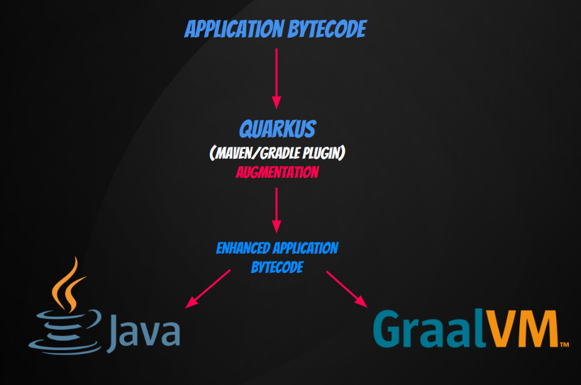

# How does the Quarkus build process work?  

## TL;DR

This post explores how Quarkus build process works internally to build your Quarkus application.

## Quarkus concepts

**Quarkus** is both a framework and a build-time **augmentation** toolkit. Applications built with Quarkus boast exceptionally fast startup times and a minimal footprint, thanks of its augmentation process.

## Augmentation

### What is augmentation?

In Quarkus, augmentation refers to a process where the framework optimizes and enhances your application bytecode during the build time:



### Maven Plugin

What happens when you execute a `mvn clean package` command? Let's see below:

If you get the `pom.xml` file into your Quarkus Application, it is possible to get the following configuration:

```xml hl_lines="9"
      <plugin>
        <groupId>${quarkus.platform.group-id}</groupId>
        <artifactId>quarkus-maven-plugin</artifactId> <!-- (1) -->
        <version>${quarkus.platform.version}</version>
        <extensions>true</extensions>
        <executions>
          <execution>
            <goals>
              <goal>build</goal> <!-- (2) -->
              <goal>generate-code</goal>
              <goal>generate-code-tests</goal>
            </goals>
          </execution>
        </executions>
      </plugin>
```

1.  Quarkus Maven Plugin
2.  Goal that calls the [`BuildMojo.java`](https://github.com/quarkusio/quarkus/blob/e87a492ecbd83a20a23c8779b166f297136e686a/devtools/maven/src/main/java/io/quarkus/maven/BuildMojo.java#L35) class.

The line `9` is the line that configures via annotation the Maven plugin to map the [`build`](https://github.com/quarkusio/quarkus/blob/e87a492ecbd83a20a23c8779b166f297136e686a/devtools/maven/src/main/java/io/quarkus/maven/BuildMojo.java#L35) goal.


```java
@Mojo(name = "build", defaultPhase = LifecyclePhase.PACKAGE, requiresDependencyResolution = ResolutionScope.COMPILE_PLUS_RUNTIME, threadSafe = true)
```

!!! info "Note"
    The value for the `defaultPhase` element is `LifecyclePhase.PACKAGE`, signifying that it will run during the package phase – which makes sense. Additionally, the `requiresDependencyResolution` element has a value of `ResolutionScope.COMPILE_PLUS_RUNTIME`, indicating that the plugin requires resolution of both compile and runtime dependencies.

## BuildMojo.java

This class extends `QuarkusBootstrapMojo.java`. The abstract `QuarkusBootstrapMojo.java` class aims to facilitate code reuse and enable the use of the [Template Method Design Pattern](https://refactoring.guru/design-patterns/template-method) through [`beforeExecute()`](https://github.com/quarkusio/quarkus/blob/e87a492ecbd83a20a23c8779b166f297136e686a/devtools/maven/src/main/java/io/quarkus/maven/QuarkusBootstrapMojo.java#L204) method. It is necessary because the others goals like `image-build` needs a another previous configuration before execute. 

After, this introduction let's see inside the principal method of `BuildMojo.java`:

1. `BuildMojo.java`'s principal method is `doExecute()`, which goes through the following steps:
    - Calls `QuarkusBootstrapMojo#bootstrapApplication()` to generate a `CuratedApplication` object.
    - The `LaunchMode` in [this case](https://github.com/quarkusio/quarkus/blob/e87a492ecbd83a20a23c8779b166f297136e686a/devtools/maven/src/main/java/io/quarkus/maven/QuarkusBootstrapMojo.java#L291) is `NORMAL`:
      ```java
        /**
        * A normal production build. At the moment this can be both native image or
        * JVM mode, but eventually these will likely be split
        */
        NORMAL("prod", "quarkus.profile")
      ```

2. The `CuratedApplication` object triggers:
    - `CuratedApplication#createAugmentor()`, creating an instance named `action` of type `AugmentAction`.

3. Within `action`, it performs:
    - Invokes augmentation via `AugmentationAction#createProductionApplication()`, creating a the result (`AugmentationResult` instance) of the augmentation process.

4. Renaming the JAR file occurs under the condition:
    - If `result.getJar() != null` evaluates to `true`.

Basically, it is like a Facade that uses the most important Quakus class on build step.


## Inside the QuarkusMavenAppBootstrap

Between the steps **1** and **2** the method from class [`QuarkusBootstrapProvider.QuarkusMavenAppBootstrap#doBootstrap(QuarkusBootstrapMojo mojo, LaunchMode mode)`](https://github.com/quarkusio/quarkus/blob/e87a492ecbd83a20a23c8779b166f297136e686a/devtools/maven/src/main/java/io/quarkus/maven/QuarkusBootstrapProvider.java#L205) is called, it is an important method too. Below, a snippet of this method is presented:

```java linenums="239"
QuarkusBootstrap.Builder builder = QuarkusBootstrap.builder()
        .setAppArtifact(appModel.getAppArtifact())
        .setExistingModel(appModel)
        .setIsolateDeployment(true)
        .setBaseClassLoader(getClass().getClassLoader())
        .setBuildSystemProperties(getBuildSystemProperties(mojo, true))
        .setProjectRoot(mojo.baseDir().toPath())
        .setBaseName(mojo.finalName())
        .setOriginalBaseName(mojo.mavenProject().getBuild().getFinalName())
        .setTargetDirectory(mojo.buildDir().toPath())
        .setForcedDependencies(forcedDependencies);

try {
    return builder.build().bootstrap();
} catch (BootstrapException e) {
    throw new MojoExecutionException("Failed to bootstrap the application", e);
}
```

Starting from line 239, the code initiates the creation of the Builder for the class responsible for constructing the `QuarkusBootstrap` instance. This process aligns with the guidelines outlined in the [official documentation](https://pt.quarkus.io/guides/class-loading-reference#bootstrapping-quarkus).

> All Quarkus applications are created by the `QuarkusBootstrap` class in the `independent-projects/bootstrap` module. This class is used to resolve all the relevant dependencies (both deployment and runtime) that are needed for the Quarkus application. The end result of this process is a `CuratedApplication`, which contains all the class loading information for the application.

> The `CuratedApplication` can then be used to create an `AugmentAction` instance, which can create production application and start/restart runtime ones. This application instance exists within an isolated ClassLoader, it is not necessary to have any of the Quarkus deployment classes on the class path as the curate process will resolve them for you.

Jumping directly to `QuarkusBootstrap#bootstrap()` [method](https://github.com/quarkusio/quarkus/blob/e87a492ecbd83a20a23c8779b166f297136e686a/independent-projects/bootstrap/core/src/main/java/io/quarkus/bootstrap/app/QuarkusBootstrap.java#L128), let see what it does.

Basically, we can assume that if the `ApplicationModel` instance is null it triest to create a `CurationResult` with another way, using `BootstrapAppModelFactory#resolveAppModel()` to create a `CurationResult` containing the `ApplicationModel` solved.

After, the method creates an instance of type `ConfiguredClassLoading` through a `builder` class. In the build method is possible to see that:

1. Try to read `application.properties` and `System.getProperties()` to see if some `quarkus.class-loading.*` configuration exists (or `quarkus.test.flat-class-path` too).

2. Populate parent first artifacts into `Set<ArtifactKey> firstFirstArtifacts;` property.
3. Check if is necessary to remove any resource from classpath (configured by `quarkus.class-loading.removed-resources` property).
4. Finally creates a `CuratedApplication` instance with all necessary data to augmentation.


## CuratedApplication

The `CuratedApplication` class has the job to create a `QuarkusClassLoader` instance and creates an instance of `"io.quarkus.runner.bootstrap.AugmentActionImpl"`.

The `AugmentActionImpl` represents a task that produces the application.

## AugmentActionImpl

The main method here is the `createProductionApplication()` that calls  `runAugment` method.

Create a `QuarkusAugmentor` instance.

## QuarkusAugmentor 

The main method here is the `run()`, this methos is the resposile for logging the following message:

```bash
[INFO] [io.quarkus.deployment.QuarkusAugmentor] Quarkus augmentation completed in 1676ms
```

## To be continued...

That concludes our initial peek into how Quarkus builds your application. Stay tuned for the next post Thank you for reading! 😊