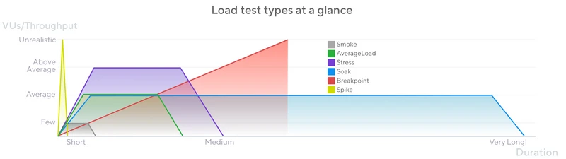

# Using K6 as Performance Test tooling

# TL;DR

We'll explore using k6 to perform a performance test simulating a promotion event.

## Imagine

Imagine that your company shares a QR code during a prominent TV program; the QR code will be displayed on the audience's TV screens for a few seconds.

You need to conduct a test beforehand to ensure the success of the campaign. It's crucial to verify that customers can access the webpage without delays. 

If you are utilizing microservices, it is crucial to ascertain the minimum number of instances needed to be prepared for upcoming loads - Keep in mind that scaling needs to occur fastly, as time is short and the volume of requests is high. Auto-scaling mechanisms may take time to scale, potentially resulting in the loss of customers. 

Basically, we need to:

1. Execute the load test
2. Tune the system
3. Repeat

## Stress testing

The behavior commented above is called **Stress testing**. In this type of testing, the system is exposed to sudden and intense traffic surges, maintains this traffic during a period of time and ramps down the quantity of requests.

## What toolings are necessary to test this behavior

### Observability 
Let's think that we are using a microservice architecture, ok? 

> You shouldn't build a microservices architecture without having observability first.

I don't remember which book this is in, but I recall reading it once. And it makes sense.

You need to know how many instances you currently have, the total number of incoming requests, so that you can make informed decisions and adjust your infrastructure according to the current needs.

Tools such as Prometheus, Grafana, New Relic, Datadog, Jaeger, etc., can assist you in handling these aspects.

### K6

K6 is a amazing load testing tooling that can help us to test this behavior. 

You write your expectation using Javascript and execute it with a simple command:

```sh
k6 run script.js
```

You can simulate some [types of load testing](https://k6.io/docs/test-types/load-test-types/) with K6:


> Reference: [K6 official documentation](https://k6.io/docs/test-types/load-test-types/) 

### Creating the script that simulates a spike test

```js linenums="1" hl_lines="5-6"
import http from "k6/http"

export const options = {
    stages: [
        { duration: '5s', target: 30000 },
        { duration: '60s', target: 31000 }
    ]
}

export default function() {
    http.get('http://localhost:8080/promotion/tv')
}
```

- **Line 5**: Stage 1 ramps up the target to 30000 over 5 seconds. This simulates the customers getting their phones to scan the QR Code.
- **Line 6**: Stage 2 ramps up the target to 31000 over 60 seconds. This simulates the continuous traffic during 1 minute.

### Testing our script Quarkus