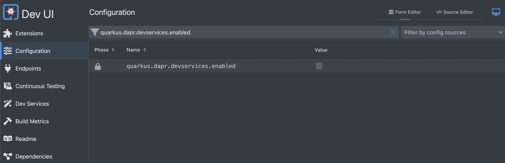

---
authors:
  - mcruzdev
draft: true 
date: 2024-09-17
categories:
  - Quarkus
  - Dapr
  - Java
  - Redis
  - Event-Driven
---

# Improve developer joy and productivity with Quarkus and Dapr

### TL;DR

If you are already using Quarkus, you are likely familiar with the incredible developer experience it offers through features such as DevServices, DevUI, and live reload. You probably appreciate how these features enhance your experience.

Now, imagine taking that developer joy to the next level when building complex distributed cloud native applications by integrating it with the productivity and standardization provided by Dapr. While Quarkus optimizes the experience for the development process of a single application, Dapr focuses more on providing best practices and well-known patterns to help developers to build distributed applications.

In this blog post, we will explore what Dapr is and how to use it in combination with the Quarkus framework.

<!-- more -->


## What is Dapr?


Dapr stands for Distributed Application Runtime: 
> Dapr is a portable, event-driven runtime that makes it easy for any developer to build resilient, stateless, and stateful applications that run on the cloud and edge and embraces the diversity of languages and developer frameworks.

In my opinion, what makes Dapr truly remarkable is the abstraction and standardization it provides in the shape of building blocks when integrated into your architecture.

### Dapr Building Blocks

So, what are Dapr building blocks? Essentially, building blocks are APIs accessed over the network through HTTP or gRPC calls. In this post, I will discuss in details only two building blocks, including: **Publish and Subscribe**, **State Management**.

Remember when I mentioned abstraction?

<diagram-here>

* Similarly, when you use the **State Management** building block, you are interacting with the Dapr runtime to store or retrieve data from a data store. This state store can be AWS DynamoDB, Azure CosmosDB, Redis, Cassandra, Firebase, and [more](https://docs.dapr.io/reference/components-reference/supported-state-stores/).

The same principle applies to **Publish and Subscribe**. You interact with the Dapr API, and Dapr takes care of communication with the message broker on your behalf. You can take a look at all the PubSub supported implementations here (https://docs.dapr.io/reference/components-reference/supported-pubsub/).

Dapr also provides other useful building blocks:

* **Service Invocation**: Perform resilient (retries and circuit breakers), secure (mtls), service-to-service method calls.
* **Workflow**: Orchestrate logic across various microservices
* **State management**: Create long running stateful services by persisting and retrieving data
* **Bindings**: Integrate reliably with or be triggered from external systems
* **Actors**: Encapsulate code and data in reusable actor objects as a common microservices design pattern
* **Secrets management**: Securely access secrets from your application
* **Configuration**: Manage and be notified of application configuration changes
* **Distributed lock**: Distributed locks provide mutually exclusive access to shared resources from an application. No need to add new libraries to your application or new components in the infrastructure.
* **Cryptography**: Perform cryptographic operations without exposing keys to your application
* **Jobs**: Manage the scheduling and orchestration of jobs

Ufa!

How do you configure all these abstractions and integration points? Let’s look at Dapr Components.

### Dapr Components


Components serve as configurations for building blocks and applications. With components, you can define specific behaviors and characteristics when utilizing a building block.

If you're an experienced developer, you might be asking: **Do I need to configure retries, dead letter queues, and resilience features if I don't have the Kafka API library to set up?**


Getting Pub/Sub building block (using Kafka) as example, you can define routes to your topic:

```yaml
apiVersion: dapr.io/v2alpha1
kind: Subscription
metadata:
  name: myevent-subscription
spec:
  type: pubsub.kafka
  pubsubname: pubsub
  topic: inventory
  routes:
    rules:
      - match: event.type == "widget"
        path: /widgets
      - match: event.type == "gadget"
        path: /gadgets
    default: /products
scopes:
  - app1
  - app2
```

Getting State management as example, you can enable transaction outbox pattern, using the component specification:

```yaml
apiVersion: dapr.io/v1alpha1
kind: Component
metadata:
  name: mysql-outbox
spec:
  type: state.mysql
  version: v1
  metadata:
  - name: connectionString
    value: "<CONNECTION STRING>"
  - name: outboxPublishPubsub # required
    value: "mypubsub"
  - name: outboxPublishTopic # required
    value: "newOrder"
  - name: outboxPubsub # optional
    value: "myOutboxPubsub"
  - name: outboxDiscardWhenMissingState # optional, defaults to false
    value: false
```

There are a bunch of configurations and Component types, to see a more detailed view, see the [official documentation for each building block](https://docs.dapr.io/reference/components-reference/).


### What is Quarkus?

Quarkus is a modern, open-source Java framework designed for building cloud-native applications. It optimizes Java specifically for Kubernetes and the cloud, providing a powerful solution for developing microservices and serverless applications. 


There are some benefits, I will list what makes sense for me actually:


* **Native Compilation**: Quarkus prepare and allows you to generate a native image for you Operational System, without the need to have a JVM running.

* **Live Reload**: When I am working with another frameworks and languages, I need to `run` >  `change` > `stop` and `run`... in a loop. With Live reload I am happy, the feedback loop is very fast.

* **Developer Joy**: With DevService and DevUI our life as developer is amazing, we do not nee more to access the Docker image documentation for a database, to copy and pase a `docker-compose.yml` file from a project to another... You just need to add an extension with DevService and your infrastructure is ready to use.

* **Subatomic and Supersonic**: Thanks to [Quarkus's mission](https://quarkus.io/guides/writing-extensions#why-an-extension-framework), uses significantly less resources (CPU/Memory) than traditional approaches.

If you want to see more benefits about Quarkus, [see the official documentation](https://quarkus.io/).

## Creating you Quarkus application with Dapr


Let's create our Quarkus application with [Quarkus CLI](https://quarkus.io/guides/cli-tooling).

```shell
quarkus create app dev.matheuscruz:try-dapr -x=io.quarkiverse.dapr:quarkus-dapr
```

The previous command creates a Quarkus application with `ìo.quarkiverse.dapr:quarkus-dapr` extension.


### Running the application

Before configuring the DevService for running Dapr, let's run our Quarkus application:


```shell
quarkus dev
```

The previous command runs the Quarkus application in dev mode.


By default, the `quarkus.dapr.devservices.enabled` is set to false. This property indicates wether the DevService for Dapr extension is enabled or not. Let's enable!

### Configuring the application

Using your browser access the [DevUI Configuration](http://localhost:8080/q/dev-ui/configuration-form-editor). You will filter by `quarkus.dapr.devservice.enabled` and check the checkbox.




!!! tip "Looking the changes"

    If you look the `application.properties` file, you will se the changes made by DevUI configuration page.

After this simple change, if you access your terminal and type `docker ps`you will se that you have a container image running.

```shell
docker ps
CONTAINER ID  IMAGE                                COMMAND               CREATED        STATUS        PORTS                                                                   NAMES

7e32f9223bd9  docker.io/testcontainers/sshd:1.2.0  echo ${USERNAME}:...  2 minutes ago  Up 2 minutes  0.0.0.0:38461->22/tcp, 22/tcp                                           blissful_solomon
2dd0127159a8  docker.io/daprio/daprd:latest        ./daprd -app-id l...  2 minutes ago  Up 2 minutes  0.0.0.0:33613->3500/tcp, 0.0.0.0:42571->50001/tcp, 3500/tcp, 50001/tcp  focused_fermi
```

The `daprio/daprd` container is the Dapr sidecar, configured by the Dapr DevService.

??? tip "Behind the scenes"

    Behind the scnes the Quarkus Dapr extension uses TestContainer API to create a container with the following command.

    ```java
    withCommand(
                "./daprd",
                "-app-id", appName, 
                "--dapr-listen-addresses=0.0.0.0",
                "--app-protocol", "http",
                "-placement-host-address", placementService + ":50006",
                "--app-channel-address", appChannelAddress,
                "--app-port", Integer.toString(appPort),
                "--log-level", daprLogLevel.toString(),
                "-components-path", "/components");
    ```

    See the `daprd` reference [here](https://docs.dapr.io/reference/arguments-annotations-overview/).


## Using Pub/Sub 

Now, we have all necessary things to use Dapr with Quarkus - We have a Dapr Sidecar container running and our Quarkus application running/listening changes.


### Publishing events 

We will create a `ProductResource` responsible for publishing message through `SyncDaprClient`.

```java

package dev.matheuscruz.product;

import io.quarkiverse.dapr.core.SyncDaprClient;
import jakarta.inject.Inject;
import jakarta.ws.rs.POST;
import jakarta.ws.rs.Path;
import jakarta.ws.rs.core.Response;

import java.util.List;
import java.util.Random;

@Path("/products")
public class ProductResource {

    static final String DEV_SERVICE_PUBSUBE_NAME = "pubsub"; // (2)

    @Inject
    SyncDaprClient syncDaprClient; // (1)

    @POST
    public Response create() {
        List<String> products = List.of("mouse", "gpu", "cpu");
        int random = new Random().nextInt(products.size());
        syncDaprClient.publishEvent(DEV_SERVICE_PUBSUBE_NAME, "products.new", // (3) 
         products.get(random));  // (4)
        return Response.accepted().build();
    }
}

```

1. The Dapr client API responsible for perform calls to Dapr Sidecar.
2. The Pub/Sub component name, by default Quarkus Dapr extension creates a Pub/Sub component with `pubsub`name.
3. The topic name.
4. The message that will be sent.

By default, [Quarkus Dapr extension uses a in-memory Pub/Sub and State Store components](https://docs.quarkiverse.io/quarkus-dapr/dev/index.html#_using_in_memory_dapr_components), but you can [declare it through](https://docs.quarkiverse.io/quarkus-dapr/dev/index.html#_adding_dapr_components) `src/main/resources/components` folder.

### Consuming events

To make our demostration more simple, let's consume the event sent in the same application.

```java
package dev.matheuscruz.product;

import io.dapr.Topic;
import io.dapr.client.domain.CloudEvent;
import jakarta.enterprise.context.ApplicationScoped;
import jakarta.ws.rs.POST;
import jakarta.ws.rs.Path;


@Path("/handlers")
@ApplicationScoped
public class ProductCreatedHandler {

    @POST
    @Topic(name = "products.new", pubsubName = "pubsub") // click (1) to see more
    @Path("/products") // (2) 
    public void handle(CloudEvent<String> event) {
        System.out.println("Received: " + event.getData());
    }
}
```

1. The `@Topic`annotation is responsible for mapping an endpoint to a topic, the `@Topic#name` is the name of the topic and the `@Topic#pubsubName` is the name of the Pub/Sub component. 

2. This is just to get your topic mapped, you can set any string on `@Path#value`, it can be `banana` if you want.

### Testing the Pub/Sub

If we make a request to `/products`:


```shell
curl -X POST http://localhost:8080/products
```

We can see the following log in our application:


```shell
Received: ...

```

## Using State Management

Let's change our `ProductCreatedHandler` to use State Management building block.


```java
package dev.matheuscruz.product;

import io.dapr.Topic;
import io.dapr.client.domain.CloudEvent;
import io.dapr.client.domain.State;
import io.dapr.utils.TypeRef;
import io.quarkiverse.dapr.core.SyncDaprClient;
import jakarta.enterprise.context.ApplicationScoped;
import jakarta.inject.Inject;
import jakarta.ws.rs.POST;
import jakarta.ws.rs.Path;

import java.util.ArrayList;
import java.util.Collections;
import java.util.List;
import java.util.UUID;

@Path("/handlers")
@ApplicationScoped
public class ProductCreatedHandler {


    @Inject
    SyncDaprClient syncDaprClient;

    @POST
    @Topic(name = "products.new", pubsubName = "pubsub") 
    @Path("/products")
    public void handle(CloudEvent<String> event) {
        System.out.println("Received: " + event.getData());
        try {
            State<Product> state = syncDaprClient.getState("kvstore",// (1)
            event.getData(), TypeRef.get(Product.class));
            System.out.println("We already have a product with name: " + state.getValue());
        } catch (Exception e) {
            System.out.println("We do not have a product :(");
            // Let's create
            syncDaprClient.saveState("kvstore", event.getData(), new Product(
                    event.getData()
            )); // (2)
        }
    }

    public record Product(String name) {}
}
```

1. Trying to get the product, the `kvstore` is the state store component name created by Quakus Dapr extension, this is a in-memory state store.

2. Saving the product.

### Testing the state store


If we make some requests to `/products` endpoint:


```shell
curl -X POST http://localhost:8080/products
```

We can see the following log in our application:


```shell
Received: book
We do not have a product :(
Received: mouse
We do not book a product :(
Received: cpu
We already have a product with name: Product[name=book]
Received: book
We already have a product with name: Product[name=book]
```

## References

- [https://docs.quarkiverse.io/quarkus-dapr/dev/index.html](https://docs.quarkiverse.io/quarkus-dapr/dev/index.html)
- [https://quarkus.io/](https://quarkus.io/)
- [https://docs.dapr.io/reference/arguments-annotations-overview/](https://docs.dapr.io/reference/arguments-annotations-overview/)
- [https://docs.dapr.io/concepts/](https://docs.dapr.io/concepts/)

## Source Code

If you want to see a real code that uses Dapr, see the following repositories:

- [https://github.com/mcruzdev/try-dapr](https://github.com/mcruzdev/try-dapr)
- [https://github.com/mcruzdev/pizza-quarkus](https://github.com/mcruzdev/pizza-quarkus)


## Thank you

That's all; thank you for reading! See you in the next post. Goodbye! 👋
