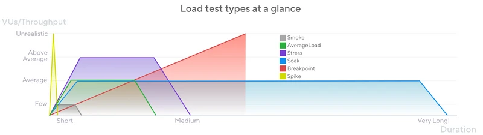

# Deploying a Quarkus application + Jaeger into Kubernetes

# TL;DR

We will explore how tools such as K6, Quarkus, Kubernetes, and Jaeger can help us perform a stress test simulating a promotion event locally.

You will learn:

- How to use K6
- How to use Qute with Quarkus
- How to build and deploy a Quarkus application into Kubernetes
- How to install Jaeger
- How to create and manage a Kubernetes created with KinD

## Imagine

Imagine that your company shares a QR code during a prominent TV program; the QR code will be displayed on the audience's TV screens for a few seconds.

You need to conduct a test beforehand to ensure the success of the campaign. It's crucial to verify that customers can access the webpage without delays. 

If you are utilizing microservices, it is crucial to ascertain the minimum number of instances needed to be prepared for upcoming loads - Keep in mind that scaling needs to occur fastly, as time is short and the volume of requests is high. Auto-scaling mechanisms may take time to scale, potentially resulting in the loss of customers. 

Basically, to get the necessary number of instances executing before the access load, we need to:

1. Execute the load test
2. Tune the system
3. Repeat

!!! info "Disclaimer"

    I decided to simulate this scenario because it recently occurred, providing an excellent opportunity to explore how to connect these tools effectively to achieve a specific goal.

<!-- more -->
## Stress testing

The behavior commented above is called **Stress testing**. In this type of testing, the system is exposed to sudden and intense traffic surges, maintains this traffic during a period of time and ramps down the quantity of requests.

## What toolings are necessary to test this behavior

### Observability

Let's think that we are using a microservice architecture, ok? 

> You shouldn't build a microservices architecture without having observability first.

I don't remember which book this is in, but I recall reading it once. And it makes total sense.

You need to know how many instances you currently have, the total number of incoming requests, so that you can make informed decisions and adjust your infrastructure according to the current needs.

Tools such as Prometheus, Grafana, New Relic, Datadog, Jaeger, etc., can assist you in handling these aspects.

### K6

K6 is a amazing load testing tooling that can help us to test this behavior. 

You write your expectation using Javascript and execute it with a simple command:

```sh
k6 run script.js
```

You can simulate some types of load testing with K6:


> Reference: [K6 official documentation](https://k6.io/docs/test-types/load-test-types/) 

### Creating the script that simulates a stress test

As mentiones K6 uses Javascript language to write the expected test. Javascript is a useful script language, K6 provide a great API is extensible (You can create an extension). Even though JavaScript was used for writing K6 tests, it was implemented in GoLang, [embedding a JavaScript engine](https://github.com/dop251/goja) for easier test scripting.


```js linenums="1" hl_lines="5-6"
import http from "k6/http"

export const options = {
    stages: [
        { duration: '5s', target: 10000 },
        { duration: '60s', target: 10000 }
    ]
}

export default function() {
    http.get('http://localhost:8080/promotion/tv')
}
```

- **Line 5**: Stage 1 ramps up the target to 30000 over 5 seconds. This simulates the customers getting their phones to scan the QR Code.
- **Line 6**: Stage 2 ramps up the target to 31000 over 60 seconds. This simulates the continuous traffic during 1 minute.

## A scalable system

There are various methods, tools, architectures, and strategies for achieving a scalable system. Options include virtualization, containers, load balancing, CDNs, and microservices, among others. In this simulation, we will employ a container orchestrator, specifically Kubernetes, to simulate the three steps required to determine the minimum instances necessary for our load testing.

## Hands-on

We will create a cluster Kuberntes with KinD, deploy our Quarkus application into the cluster, and execute the K6 script targeting our applications.

### Creating the Kubernetes cluster

We will create a Kubernetes cluster with Kubernetes in Docker (KinD), as the name said, KinD aims to execute a cluster Kubernetes inside docker.

Our Kubernetes cluster will have 1 control plane and 3 workers nodes!

```sh
cat <<EOF | kind create cluster --name dev --config=-
kind: Cluster
apiVersion: kind.x-k8s.io/v1alpha4
nodes:
- role: control-plane
  kubeadmConfigPatches:
  - |
    kind: InitConfiguration
    nodeRegistration:
      kubeletExtraArgs:
        node-labels: "ingress-ready=true"
  extraPortMappings:
  - containerPort: 80
    hostPort: 80
    protocol: TCP
  - containerPort: 443
    hostPort: 443
    protocol: TCP
- role: worker
- role: worker
- role: worker
EOF
```

After running the command, the ouput should seems like it:

??? info "The ouput should looks like it."

    ```sh
    Creating cluster "dev" ...
    ✓ Ensuring node image (kindest/node:v1.26.3) 🖼
    ✓ Preparing nodes 📦 📦 📦 📦  
    ✓ Writing configuration 📜 
    ✓ Starting control-plane 🕹️ 
    ✓ Installing CNI 🔌 
    ✓ Installing StorageClass 💾 
    ✓ Joining worker nodes 🚜 
    Set kubectl context to "kind-dev"
    You can now use your cluster with:

    kubectl cluster-info --context kind-dev

    Have a nice day! 👋
    ```

### Installing Jaeger Operator

```yaml
kind: RoleBinding
apiVersion: rbac.authorization.k8s.io/v1
metadata:
  name: jaeger-operator-in-myproject
  namespace: myproject
subjects:
- kind: ServiceAccount
  name: jaeger-operator
  namespace: observability
roleRef:
  kind: Role
  name: jaeger-operator
  apiGroup: rbac.authorization.k8s.io
```

### Creating the Quarkus application

We will use Quarkus because is very simple to deploy an application into Kubernetes, we will use Quarkus CLI to deploy the application.

Let's create the Quarkus application with all necessary extensions:

```sh
quarkus create app com.github.mcruzdev:k6-with-quarkus --extension='quarkus-opentelemetry,resteasy-reactive,quarkus-resteasy-reactive-qute'
```

??? info "The ouput should looks like it."

    ```sh
      -----------
      selected extensions: 
      - io.quarkus:quarkus-resteasy-reactive
      - io.quarkus:quarkus-opentelemetry
      - io.quarkus:quarkus-resteasy-reactive-qute


      applying codestarts...
      📚 java
      🔨 maven
      📦 quarkus
      📝 config-properties
      🔧 dockerfiles
      🔧 maven-wrapper
      🚀 resteasy-reactive-codestart
      🚀 resteasy-reactive-qute-codestart

      -----------
      [SUCCESS] ✅  quarkus project has been successfully generated in:
      --> /home/cruz/k6-with-quarkus
    ```

### Creating the template with Qute

```html linenums="1" hl_lines="3 15"
<!-- src/main/resources/templates/promotion.html -->

{@java.lang.String cupom} <!--1-->
<!DOCTYPE html>
<html lang="en">
<head>
    <meta charset="UTF-8">
    <meta name="viewport" content="width=device-width, initial-scale=1.0">
    <script src="https://cdn.tailwindcss.com"></script>

    <title>TV Promotion simulation with K6 and Quarkus</title>
</head>
<body class="h-screen w-screen flex flex-row items-center justify-center">
    <h1 class="text-3xl font-bold">
        Cupom applied! Your cupom is <span class="text-blue-900">{cupom}</span>! <!--2-->
    </h1>
</body>
</html>
```

1. At line **"3"**, we are declaring the Qute template parameter `cupom` as String.
2. At line **"15"**, we are using the data `cupom` data inside the template.

### Creating the `/promotion/tv` page

```java linenums="1" hl_lines="17"
package dev.matheuscruz;

import java.util.UUID;

import io.quarkus.qute.Template;
import io.quarkus.qute.TemplateInstance;
import jakarta.inject.Inject;
import jakarta.ws.rs.GET;
import jakarta.ws.rs.Path;
import jakarta.ws.rs.Produces;
import jakarta.ws.rs.core.MediaType;

@Path("/promotion")
public class PromotionResource {

    @Inject
    Template promotion; // (1)

    @GET
    @Path("/tv")
    @Produces(MediaType.TEXT_HTML)
    public TemplateInstance tv() {
        return promotion.data(
                "cupom", UUID.randomUUID().toString()); // (2)
    }

}
```

1. Quarkus injects the `Template` instance and maps the field name to a HTML file in `src/main/resources/promotion.html`. If you change the field `promotion` to `promo`, you need to change the `promotion.html` file name to `promo.html`.  You can use the `@io.quarkus.qute.Location` annotation to specify the file inside `src/main/resources` directory, in other words, with this annotation you can change the field name without change the HTML file in the resource directory.
2. Here, we are using the `Template` instance passing a data `"cupom"` (as String) to the template to get a `TemplateInstace` object.

If you run the application with `quarkus dev`, and access [here](http://localhost:8080/promotion/tv), the output should looks something like this:


### Creating a Docker image with Jib

Quarkus offers some extensions to build an push container images to container registry, [Jib](https://github.com/GoogleContainerTools/jib) is one of them.

You just need to add the jib extension and configure the application.properties to build the container image on building.

Add the following dependency into the `pom.xml` file.

```xml
<!-- pom.xml -->
<dependency>
      <groupId>io.quarkus</groupId>
      <artifactId>quarkus-container-image-jib</artifactId>
    </dependency>
```

Add the following property into `application.properties` file.

```properties
quarkus.container-image.build=true
```

??? tip "Changing the container image info"

    By default, Quarkus uses your system username to generate the image group. To change it, Quarkus offers some configurations to change the image name info:

    ```properties
    quarkus.container-image.group=your-group
    quarkus.container-image.name=k6-with-quarkus
    quarkus.container-image.tag=1.0-version-here
    ```


After this configuration, let's build our image:

```sh
quarkus build
```

We can view the result running:
```sh
docker images | grep k6-with-quarkus

matheuscruzdev/k6-with-quarkus  1.0 3ee7138f017a  23 seconds ago  429MB
```

Let's push our image to Docker Registry:

```sh
docker push matheuscruzdev/k6-with-quarkus:1.0 
```

Quarkus offers it for us, see [here](https://quarkus.io/guides/deploying-to-kubernetes#defining-a-docker-registry).

### Adding Kubernetes extension

Quarkus allows us to create a Kubernetes resources based in our application. Is possible to generate specific resources for KinD, Kubernetes, OpenShift and Knative.

Let's install the Quarkus extension for KinD:

```xml
<dependency>
    <groupId>io.quarkus</groupId>
    <artifactId>quarkus-kind</artifactId>
</dependency>
```

After installing, we just need to deploy our application:

```sh
quarkus build
```

And apply the generated Kubernetes resources to our KinD cluster:

```sh
kubectl apply -f target/kubernetes/kind.yml
```

??? tip "Using `quarkus deploy`"

    You can use `quarkus deploy` command to deploy your application into KinD cluster. Is necessary to configure the `quarkus.kubernetes.namespace=default` into application.properties.

If we execute a `kubectl get deployments` command, we can see the following output:

```sh
NAME              READY   UP-TO-DATE   AVAILABLE   AGE
k6-with-quarkus   1/1     1            1           24m
```

### Starting our Testing

Before, creating our test, we need to define the our goals. **We want that 95% of requests fall below 200ms of duration**, this is measured by the `p(95)` metric. 


Let's thought that we are expecting a load of 10.000 RPS during 60 seconds.

A best practice is to start with a small load, feel the system, and grow up using steb-by-step approach.

For this scenario we will break the test into 3 stages. After every stage I will change the quantity of replicas necessary for our `Deployment` object.

### Results

**Stage 1**

```yaml
replicas: 6
stages:
  - target: 7500
    duration: 5s
  - target: 7750
    duration: 60s
result: running (1m05.4s), 0000/7750 VUs, 863070 complete and 0 interrupted iterations
```
??? info "Stage 1: Summary"

    ```sh
    scenarios: (100.00%) 1 scenario, 7500 max VUs, 1m35s max duration (incl. graceful stop):
            * default: Up to 7500 looping VUs for 1m5s over 2 stages (gracefulRampDown: 30s, gracefulStop: 30s)


     data_received..................: 468 MB 7.2 MB/s
     data_sent......................: 72 MB  1.1 MB/s
     http_req_blocked...............: avg=17.78µs  min=708ns   med=1.91µs   max=236.34ms p(90)=2.72µs   p(95)=3.44µs  
     http_req_connecting............: avg=10.75µs  min=0s      med=0s       max=42.85ms  p(90)=0s       p(95)=0s      
     http_req_duration..............: avg=601.13ms min=37.9ms  med=532.96ms max=3.64s    p(90)=952.65ms p(95)=1.1s    
       { expected_response:true }...: avg=601.13ms min=37.9ms  med=532.96ms max=3.64s    p(90)=952.65ms p(95)=1.1s    
     http_req_failed................: 0.00%  ✓ 0            ✗ 779857
     http_req_receiving.............: avg=2.71ms   min=9.12µs  med=22.61µs  max=380.66ms p(90)=57.28µs  p(95)=335.94µs
     http_req_sending...............: avg=79.3µs   min=3.38µs  med=8.45µs   max=318.8ms  p(90)=12µs     p(95)=51.06µs 
     http_req_tls_handshaking.......: avg=0s       min=0s      med=0s       max=0s       p(90)=0s       p(95)=0s      
     http_req_waiting...............: avg=598.33ms min=37.86ms med=531.06ms max=3.64s    p(90)=946.62ms p(95)=1.09s   
     http_reqs......................: 779857 11927.559579/s
     iteration_duration.............: avg=602.59ms min=37.96ms med=534.55ms max=3.64s    p(90)=954.44ms p(95)=1.1s    
     iterations.....................: 779857 11927.559579/s
     vus............................: 7500   min=913        max=7500
     vus_max........................: 7500   min=7500       max=7500


    running (1m05.4s), 0000/7500 VUs, 779857 complete and 0 interrupted iterations
    default ✓ [======================================] 0000/7500 VUs  1m5s
    ```

**Stage 2**

```yaml
replicas: 12
stages:
  - target: 10000
    duration: 5s
  - target: 10000
    duration: 60s
result: running (1m05.5s), 0000/7750 VUs, 837978 complete and 0 interrupted iterations
```

??? info "Stage 2: Summary"

    ```sh
     data_received..................: 503 MB 7.7 MB/s
     data_sent......................: 77 MB  1.2 MB/s
     http_req_blocked...............: avg=150.31µs min=694ns  med=1.93µs   max=399.81ms p(90)=2.84µs   p(95)=3.55µs  
     http_req_connecting............: avg=127.35µs min=0s     med=0s       max=399.76ms p(90)=0s       p(95)=0s      
     http_req_duration..............: avg=567.63ms min=5.48ms med=519.57ms max=2.53s    p(90)=916.88ms p(95)=1.07s   
       { expected_response:true }...: avg=567.63ms min=5.48ms med=519.57ms max=2.53s    p(90)=916.88ms p(95)=1.07s   
     http_req_failed................: 0.00%  ✓ 0            ✗ 837978
     http_req_receiving.............: avg=2.66ms   min=7.78µs med=22.79µs  max=590.92ms p(90)=67.73µs  p(95)=367.01µs
     http_req_sending...............: avg=270.88µs min=3.39µs med=8.63µs   max=351.31ms p(90)=13.09µs  p(95)=79.02µs 
     http_req_tls_handshaking.......: avg=0s       min=0s     med=0s       max=0s       p(90)=0s       p(95)=0s      
     http_req_waiting...............: avg=564.7ms  min=5.45ms med=517.15ms max=2.53s    p(90)=909.49ms p(95)=1.07s   
     http_reqs......................: 837978 12787.914947/s
     iteration_duration.............: avg=570.03ms min=5.51ms med=521.45ms max=2.54s    p(90)=919.7ms  p(95)=1.07s   
     iterations.....................: 837978 12787.914947/s
     vus............................: 7748   min=891        max=7748
     vus_max........................: 7750   min=7750       max=7750
    ```

**Stage 3**

```yaml
replicas: 16
stages:
  - target: 10000
    duration: 5s
  - target: 10000
    duration: 60s
result: running (1m05.5s), 0000/7750 VUs, 837978 complete and 0 interrupted iterations
```

??? info "Stage 3: Summary"

    ```sh
     data_received..................: 503 MB 7.7 MB/s
     data_sent......................: 77 MB  1.2 MB/s
     http_req_blocked...............: avg=150.31µs min=694ns  med=1.93µs   max=399.81ms p(90)=2.84µs   p(95)=3.55µs  
     http_req_connecting............: avg=127.35µs min=0s     med=0s       max=399.76ms p(90)=0s       p(95)=0s      
     http_req_duration..............: avg=567.63ms min=5.48ms med=519.57ms max=2.53s    p(90)=916.88ms p(95)=1.07s   
       { expected_response:true }...: avg=567.63ms min=5.48ms med=519.57ms max=2.53s    p(90)=916.88ms p(95)=1.07s   
     http_req_failed................: 0.00%  ✓ 0            ✗ 837978
     http_req_receiving.............: avg=2.66ms   min=7.78µs med=22.79µs  max=590.92ms p(90)=67.73µs  p(95)=367.01µs
     http_req_sending...............: avg=270.88µs min=3.39µs med=8.63µs   max=351.31ms p(90)=13.09µs  p(95)=79.02µs 
     http_req_tls_handshaking.......: avg=0s       min=0s     med=0s       max=0s       p(90)=0s       p(95)=0s      
     http_req_waiting...............: avg=564.7ms  min=5.45ms med=517.15ms max=2.53s    p(90)=909.49ms p(95)=1.07s   
     http_reqs......................: 837978 12787.914947/s
     iteration_duration.............: avg=570.03ms min=5.51ms med=521.45ms max=2.54s    p(90)=919.7ms  p(95)=1.07s   
     iterations.....................: 837978 12787.914947/s
     vus............................: 7748   min=891        max=7748
     vus_max........................: 7750   min=7750       max=7750
    ```

